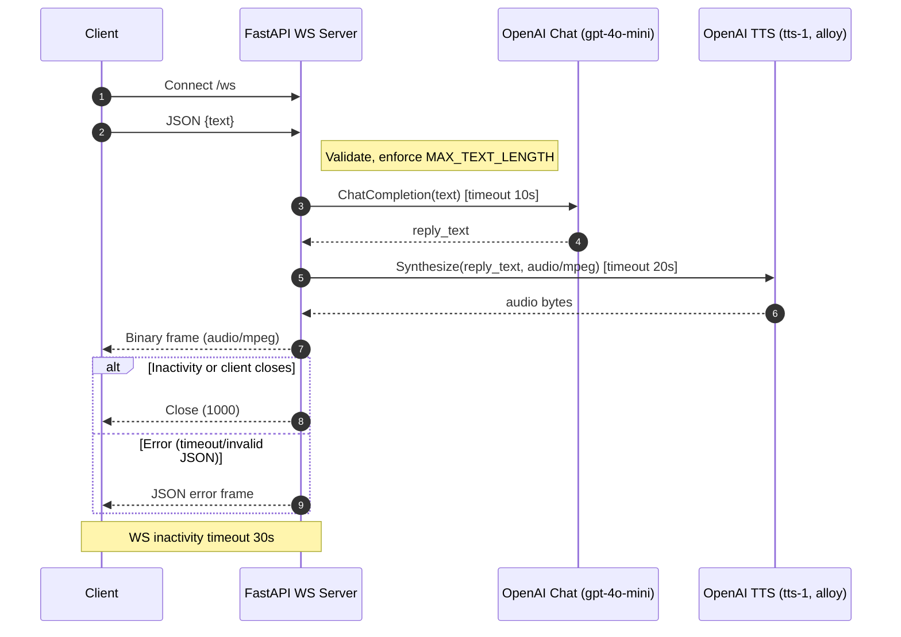

# System Requirements Specification — LLM→TTS WebSocket Service

## 1. Introduction

### 1.1 Purpose
This document defines the **system requirements** for a WebSocket-based microservice that converts client-submitted text into synthesized speech using OpenAI APIs.  
It also specifies a simple **Python test client** for verification purposes.  
The intended audience is engineers responsible for development, deployment, and maintenance of the service.

### 1.2 Scope
The system consists of two components:
1. **WebSocket Service** — a standalone, stateless FastAPI + Uvicorn microservice.
2. **Test Client** — a simple Python command-line tool to send text and receive audio files for testing.

The service will:
- Accept text over WebSocket.
- Query OpenAI Chat API for a text response.
- Generate synthesized audio from that response using OpenAI TTS.
- Return the complete audio file as a binary message to the client.

The MVP returns the **full audio file** once generated. A future version will **stream audio chunks** as they are produced.

### 1.3 System Overview
The service operates as an independent microservice, accessible via WebSocket or HTTP endpoints.  
It connects directly to OpenAI’s Chat and TTS APIs.  
Deployment targets:
- **Development:** via `ngrok` (public tunneling)
- **Production:** via **Render.com** as a containerized ASGI app.

---

## 2. System Architecture

### 2.1 High-Level Components
- **FastAPI WebSocket Server:** handles incoming connections and routing.
- **ChatService:** sends text to OpenAI Chat Completion API.
- **TtsService:** converts the LLM reply into audio using OpenAI TTS API.
- **Config Layer:** manages environment variables (Pydantic Settings).
- **Test Client:** minimal async client using `websockets` or `aiohttp` to validate functionality.

### 2.2 Deployment Context
- **Dev:** local FastAPI server exposed with `ngrok` for testing.
- **Prod:** Render.com container, served via Uvicorn.
- Stateless operation — no database or persistent storage.

### 2.3 Data Flow Overview
1. Client connects to `/ws` endpoint.
2. Sends JSON message: `{ "text": "Hello" }`.
3. Server calls OpenAI Chat API (model: `gpt-4o-mini`).
4. Receives text reply.
5. Sends text to OpenAI TTS API (model: `tts-1`, voice: `alloy`, output format: `audio/mpeg`).
6. Returns audio binary to client.
7. WebSocket remains open or closes gracefully.

---

## 3. Functional Requirements

### 3.1 WebSocket API
- **Endpoint:** `/ws`
- **Input Message:**
  ```json
  { "text": "User message text" }
  ```
- **Output Message:**
  - Binary audio payload (MIME type: `audio/mpeg`).
  - Optional metadata JSON frame for errors or status.
- **Behavior:**
  - On valid input: respond with synthesized audio.
  - On invalid input: return JSON error frame.
  - Enforce max input length (1000 characters).

### 3.2 HTTP Endpoints
| Endpoint | Method | Purpose |
|-----------|---------|----------|
| `/healthz` | GET | Returns `{"status": "ok"}` to confirm service readiness. |
| `/version` | GET | Returns JSON with app version and environment info. |

### 3.3 OpenAI Chat Interface
- **Model:** `gpt-4o-mini`
- **Input:** text prompt from WebSocket payload.
- **Output:** textual response suitable for TTS.
- **Timeout:** 10 seconds.
- **Error Handling:** timeout → return JSON error to client.

### 3.4 OpenAI TTS Interface
- **Model:** `tts-1`
- **Voice:** `alloy`
- **Output Format:** `audio/mpeg`
- **Timeout:** 20 seconds.
- **Behavior:** takes LLM output as input, returns binary audio data.

### 3.5 Test Client
- **Language:** Python 3.11+
- **Dependencies:** `websockets`, `asyncio`
- **Usage:**
  ```bash
  python client/test_client.py --text "Hello world" --save output.mp3
  ```
- **Behavior:**
  - Connect to `/ws` endpoint.
  - Send text payload.
  - Receive audio binary and save to file.
  - Log round-trip latency.

---

## 4. System Behavior

### 4.1 Connection Lifecycle
- Accept multiple concurrent WS connections.
- Enforce a **30-second inactivity timeout** per connection.
- Automatically close WS session on client disconnect or error.

### 4.2 Request Flow
1. Receive text payload.
2. Validate JSON structure and text length.
3. Query Chat API → receive response.
4. Query TTS API → receive audio.
5. Send audio as binary WS frame.
6. Log all events with timestamps.

### 4.3 Error Handling
- Catch `httpx.TimeoutException`, return `{ "error": "timeout" }`.
- Validate payload format and reject malformed JSON.
- Handle WS disconnects gracefully (cancel pending async tasks).

### 4.4 Logging & Observability
- Log request ID, input size, model latency, and response time.
- Logs written to stdout in structured JSON format.
- No external monitoring in MVP.

---

## 5. Non-Functional Requirements

### 5.1 Performance
- Average latency (Chat + TTS) under 5 seconds for text ≤ 50 words.
- System supports ≥ 50 concurrent active WebSocket connections per instance.

### 5.2 Scalability
- Horizontally scalable via multiple ASGI workers.
- Stateless: no shared session or persistent state required.

### 5.3 Security
- Stateless; no data persistence or storage.
- Configuration and API keys provided via environment variables only.
- TLS termination handled by platform (Render/ngrok).
- Authentication and rate limiting considered **future enhancements**.

### 5.4 Maintainability
- Codebase structured by component (`services`, `routes`, `config`).
- Minimal dependencies for ease of updates.
- Pydantic models enforce schema consistency.

### 5.5 Reliability
- Graceful shutdown and connection cleanup.
- Proper timeout management prevents hung requests.
- No retries on failed OpenAI requests (fail fast strategy).

---

## 6. Environment & Configuration

### 6.1 Environment Variables
| Variable | Default | Description |
|-----------|----------|-------------|
| `OPENAI_API_KEY` | — | OpenAI key with Chat + TTS access |
| `CHAT_MODEL` | `gpt-4o-mini` | Model for chat responses |
| `TTS_MODEL` | `tts-1` | Model for TTS synthesis |
| `TTS_VOICE` | `alloy` | Voice used for audio generation |
| `LOG_LEVEL` | `info` | Logging verbosity |
| `PORT` | `8000` | Server port |
| `MAX_TEXT_LENGTH` | `1000` | Character limit per input |

### 6.2 Dependencies
- **FastAPI**, **Uvicorn**, **httpx**, **pydantic-settings**, **asyncio**, **tenacity** (optional).

### 6.3 Resource Expectations
- Memory: < 512 MB per instance (for short-lived audio buffers).
- CPU: 1 vCPU sufficient for 10–20 concurrent users.
- No disk storage required.

---

## 7. Future Considerations

1. **Streaming Audio:** Support partial audio frame streaming for lower latency.
2. **Authentication:** Add API key or JWT-based access.
3. **Rate Limiting:** Per-connection and per-IP caps.
4. **Observability:** Integrate metrics (Prometheus / OpenTelemetry).
5. **Voice Selection:** Allow clients to specify TTS voice dynamically.
6. **Error Analytics:** Aggregate error metrics and request volumes.

---

## 8. Summary
This SRS defines the technical requirements and behavioral expectations for a **stateless, asynchronous WebSocket service** that transforms text into synthesized speech using OpenAI APIs.  
It serves as the foundational specification for implementation and future enhancement toward real-time audio streaming and production readiness.


## Appendix: Sequence Diagram


