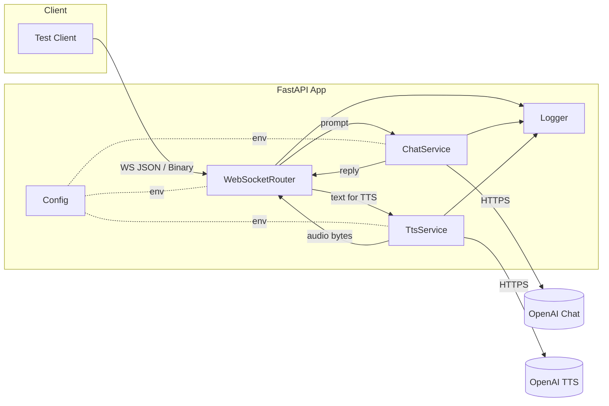
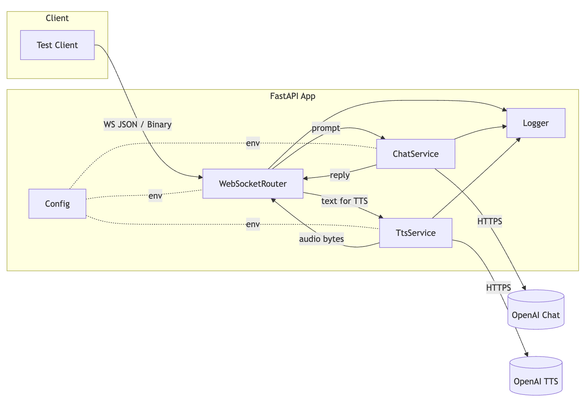
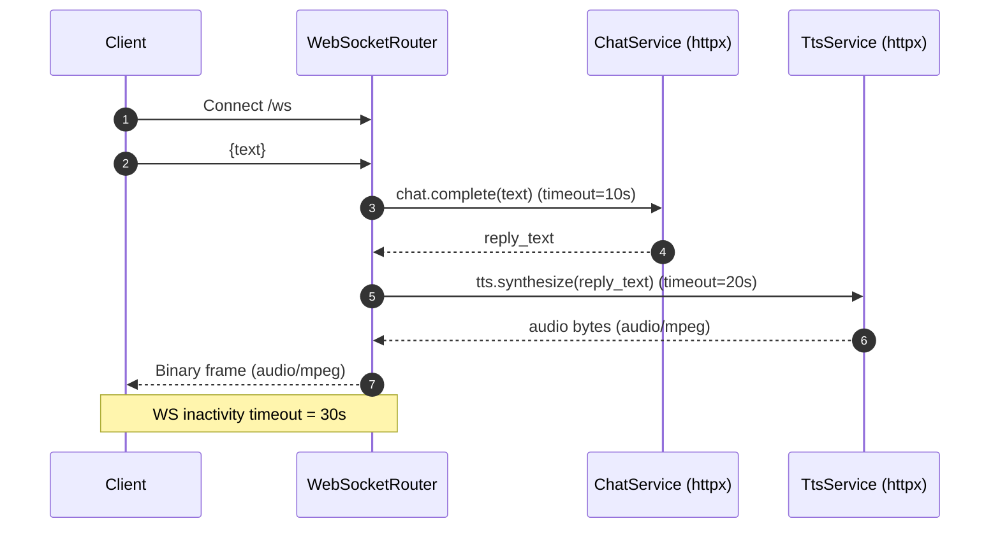
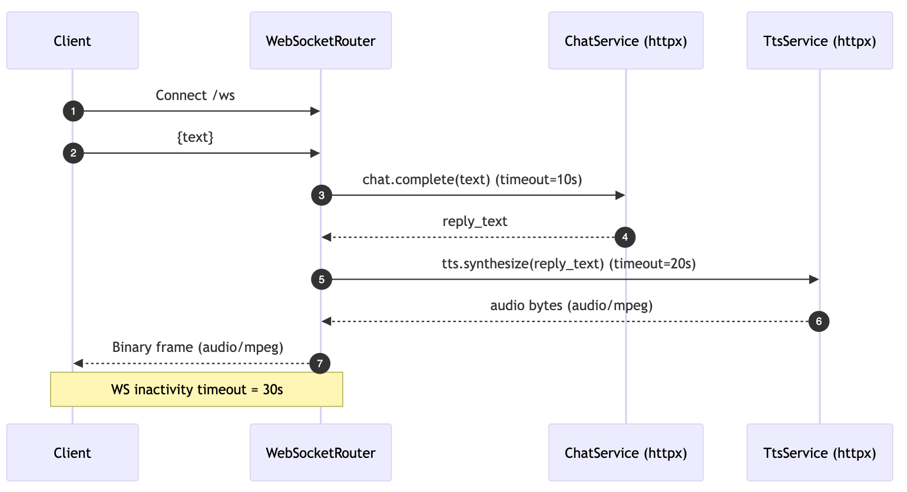

# Technical Design Document (TDD) — LLM→TTS WebSocket Service

**Status:** Draft (MVP scope)\
**Owners:** Engineering\
**Related docs:** PRD — LLM→TTS WebSocket Service; SRS — LLM→TTS WebSocket Service

---

## 1. Purpose & Scope

This TDD describes the **internal design** of a stateless WebSocket microservice that accepts text, calls OpenAI Chat for a reply, synthesizes that reply with OpenAI TTS, and returns the **complete audio file** to the client over the same WebSocket connection. A very simple **Python test client** is included in scope. Streaming audio (chunked WS) is listed as a near-term extension but **out of MVP scope**.

---

## 2. Architecture Overview

### 2.1 High-Level Components

- **App (FastAPI + Uvicorn)**: ASGI application exposing `/ws`, `/healthz`, `/version`.
- **WebSocketRouter**: Connection handling, message validation, lifecycle & timeouts.
- **ChatService**: Adapter to OpenAI Chat Completions (`gpt-4o-mini`).
- **TtsService**: Adapter to OpenAI TTS (`tts-1`, voice `alloy`, `audio/mpeg`).
- **Config**: Environment-driven settings (pydantic-settings).
- **Logging**: Structured JSON logs to stdout.
- **Test Client**: Minimal async CLI to send text and save returned audio.

### 2.2 Deployment Topology

- **Dev:** local server + `ngrok` URL for external testing.
- **Prod:** containerized on Render.com; single or multiple ASGI workers behind a WS-capable proxy.

### 2.3 Component Diagram





### 2.4 Sequence (MVP)





---

## 3. Detailed Design

### 3.1 Modules & Responsibilities

**Application bootstrap**

- Build FastAPI app; register HTTP and WS routes.
- Wire dependencies for `Settings`, `ChatService`, `TtsService`.
- Expose HTTP endpoints: `/healthz`, `/version`.

**WebSocket endpoint**

- Provide ASGI WebSocket endpoint at `/ws`.
- Validate incoming JSON payloads against `MessageIn` pydantic model.
- Enforce `MAX_TEXT_LENGTH`, per-connection single in‑flight request, and inactivity timeout.
- Send audio as a **binary** WS frame (`audio/mpeg`) on success; send **JSON error frames** on failure.

**OpenAI Chat adapter**

- `ChatService.complete(text: str) -> str`.
- Use `httpx.AsyncClient` with base headers and **10s timeout**.
- Build request for model `CHAT_MODEL` (default `gpt-4o-mini`).
- Parse response content and return reply text.

**OpenAI TTS adapter**

- `TtsService.synthesize(text: str) -> bytes`.
- Use `httpx.AsyncClient` with **20s timeout**.
- Request `TTS_MODEL` (default `tts-1`), `TTS_VOICE=alloy`, `format=audio/mpeg`.
- Return raw audio bytes.

**Settings**

- Pydantic `Settings` with:
  - `OPENAI_API_KEY` (required)
  - `CHAT_MODEL = gpt-4o-mini`
  - `TTS_MODEL = tts-1`
  - `TTS_VOICE = alloy`
  - `PORT = 8000`, `LOG_LEVEL = info`
  - `MAX_TEXT_LENGTH = 1000`
  - `WS_INACTIVITY_TIMEOUT = 30`
  - `CHAT_TIMEOUT = 10`, `TTS_TIMEOUT = 20`

**Minimal test client**

- Connect to `ws://HOST:PORT/ws`.
- Send `{"text": "..."}`; receive binary frame; write `output.mp3`.
- Print round‑trip latency and basic diagnostics.

### 3.2 Data Contracts

**WebSocket Input**

```json
{ "text": "Your input text here" }
```

**Constraints**: required `text` (UTF‑8), `1..MAX_TEXT_LENGTH` characters.

**WebSocket Output (success)**

- Binary WebSocket frame containing `audio/mpeg` bytes.

**WebSocket Output (error)**

```json
{ "error": { "code": "<string>", "message": "<human readable>" } }
```

**Error codes**: `invalid_json`, `text_too_long`, `chat_timeout`, `tts_timeout`, `openai_error`, `internal_error`.

**HTTP**

```json
{ "status": "ok" }
```

**HTTP**

```json
{ "name": "llm-tts-ws", "version": "1.0.0" }
```

### 3.3 OpenAI Adapters

- **Auth:** `Authorization: Bearer ${OPENAI_API_KEY}`.
- **Transport:** `httpx.AsyncClient` with per‑call timeouts; **no retries** (per SRS).
- **Error mapping:**
  - `httpx.TimeoutException` → `chat_timeout` or `tts_timeout`.
  - 4xx/5xx from OpenAI → `openai_error` (include status code; redact sensitive body).

### 3.4 Timeouts & Limits

- **Chat:** 10 s request timeout.
- **TTS:** 20 s request timeout.
- **WebSocket inactivity:** 30 s per connection.
- **Max input length:** 1000 chars.
- **Max message size:** framework defaults for MVP; document in README.

### 3.5 Concurrency & Backpressure

- One coroutine per connection.
- **Single in‑flight** synthesis per connection (reject or queue additional messages until completion).
- Protect upstream using worker limits; (future) instance semaphores and rate limiting.

### 3.6 Logging

- Structured JSON to stdout.
- Include: `request_id` (uuid4), timestamps, event (`ws_connected`, `chat_started`, `chat_finished`, `tts_started`, `tts_finished`, `ws_sent_audio`, `error`), durations, and sizes.
- Never log secrets; truncate long inputs in logs.

### 3.7 Error Handling Strategy

- Validation → `invalid_json` / `text_too_long`.
- Timeouts → `chat_timeout` / `tts_timeout`.
- OpenAI errors → `openai_error` with HTTP status.
- Unexpected exceptions → `internal_error`; keep WS open when possible; close on repeated malformed frames or disconnect.

### 3.8 Security Considerations

- Stateless; no persistence of text or audio.
- Secrets via env only; do not log secrets.
- TLS terminated by ngrok / Render ingress.
- Browser hardening (origins/CORS) deferred; current client is CLI.

## 4. Pseudocode Sketches

Pseudocode Sketches

### 4.1 WebSocket Handler (simplified)

```text
on_ws_connect(ws):
  set deadline = now + WS_INACTIVITY_TIMEOUT
  loop:
    msg = await ws.recv_json(timeout=deadline)
    validate msg.text and length

    start = now()
    try:
      reply_text = await ChatService.complete(msg.text, timeout=CHAT_TIMEOUT)
    except Timeout:
      ws.send_json(error(chat_timeout)); continue
    except OpenAIError as e:
      ws.send_json(error(openai_error, status=e.status)); continue

    try:
      audio = await TtsService.synthesize(reply_text, timeout=TTS_TIMEOUT)
    except Timeout:
      ws.send_json(error(tts_timeout)); continue
    except OpenAIError as e:
      ws.send_json(error(openai_error, status=e.status)); continue

    await ws.send_bytes(audio)  # audio/mpeg
    log duration(now()-start)
```

### 4.2 ChatService

```text
complete(text, timeout):
  req = build_chat_request(model=CHAT_MODEL, messages=[{"role":"user","content": text}])
  res = await httpx.post(url, headers=auth, json=req, timeout=timeout)
  handle_non_2xx(res)
  return extract_content(res.json())
```

### 4.3 TtsService

```text
synthesize(text, timeout):
  req = build_tts_request(model=TTS_MODEL, voice=TTS_VOICE, format="audio/mpeg", input=text)
  res = await httpx.post(url, headers=auth, json=req, timeout=timeout)
  handle_non_2xx(res)
  return res.content  # bytes
```

---

## 5. Configuration

### 5.1 Environment Variables

| Var                     | Default       | Notes                       |      |         |         |
| ----------------------- | ------------- | --------------------------- | ---- | ------- | ------- |
| `OPENAI_API_KEY`        | (required)    | Bearer token for Chat & TTS |      |         |         |
| `CHAT_MODEL`            | `gpt-4o-mini` | Chat completions model      |      |         |         |
| `TTS_MODEL`             | `tts-1`       | TTS model                   |      |         |         |
| `TTS_VOICE`             | `alloy`       | Default voice               |      |         |         |
| `PORT`                  | `8000`        | Bind port                   |      |         |         |
| `LOG_LEVEL`             | `info`        | \`debug                     | info | warning | error\` |
| `MAX_TEXT_LENGTH`       | `1000`        | Input length guard          |      |         |         |
| `WS_INACTIVITY_TIMEOUT` | `30`          | Seconds                     |      |         |         |
| `CHAT_TIMEOUT`          | `10`          | Seconds                     |      |         |         |
| `TTS_TIMEOUT`           | `20`          | Seconds                     |      |         |         |

### 5.2 Defaults & Overrides

- All values configurable via environment; no config files or CLI flags in MVP.

---

## 6. Testing Strategy

### 6.1 Unit Tests

- **ChatService**: builds correct payload; handles 2xx/4xx/5xx; timeout mapping.
- **TtsService**: payload correctness; content handling; timeout mapping.
- **Validation**: input length, bad JSON cases.

### 6.2 Integration Tests

- Launch app in test mode (`uvicorn` or in-process ASGI lifespan).
- WebSocket round-trip: send short text → receive MP3 bytes → non-empty file.
- Error paths: inject chat timeout; inject tts timeout; send oversized text.

### 6.3 Test Client (Manual/CLI)

- `python client/test_client.py --text "Hello" --save out.mp3`
- Confirm file type (MPEG header) and playback.

### 6.4 Load Sanity (Non-exhaustive)

- 20–50 concurrent clients, short inputs; observe latencies and errors.

### 6.5 Observability

- Verify logs include request\_id, durations, and error codes.

---

## 7. Deployment & Operations

- Container image with non-root user.
- Uvicorn command: `uvicorn app.main:app --host 0.0.0.0 --port ${PORT}`.
- Health checks hitting `/healthz`.
- Render.com: enable WS; confirm idle timeouts and max frame sizes.
- Ngrok: document command to expose `/ws` for dev testing.

---

## 8. Risks & Mitigations

| Risk                                  | Mitigation                                                     |
| ------------------------------------- | -------------------------------------------------------------- |
| Timeouts from upstream (LLM/TTS)      | Fail fast with clear error frames; surface in logs             |
| Large inputs causing long synth times | Enforce `MAX_TEXT_LENGTH`; document guidance                   |
| Memory pressure from audio buffers    | Keep audio non-streaming but short; consider streaming in v1.1 |
| Event loop blocking                   | Use only async IO; avoid CPU-heavy ops                         |

---

## 9. Future: Streaming Audio Design Notes (v1.1)

- **Protocol:** switch to multiple binary frames; optional JSON control frames (`start`, `chunk`, `end`, `error`).
- **Client:** play-as-you-receive buffer; handle out-of-order frames if any.
- **Server:** generator-based synthesis if supported, else chunk response body while reading.
- **Backpressure:** only send next chunk after prior WS `drain`/await; throttle on slow clients.

